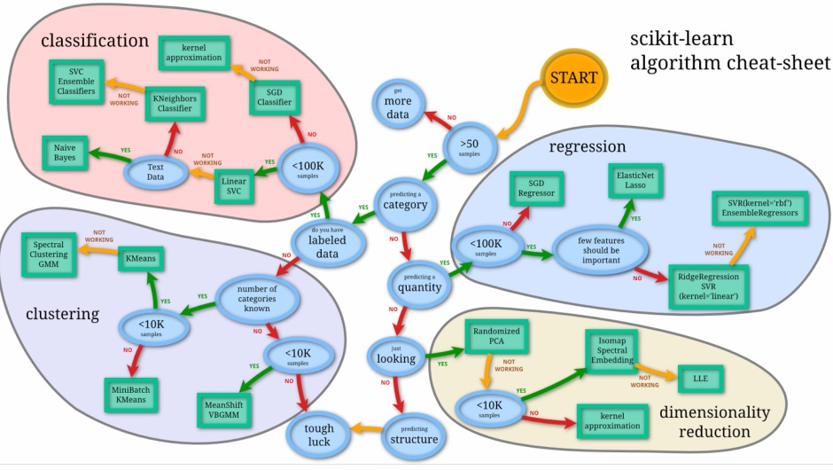
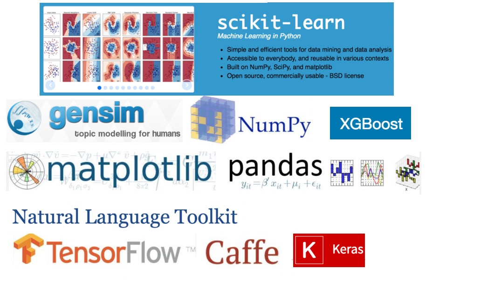

# Kaggle

> train loss 与 test loss 结果分析

* train loss 不断下降，test loss不断下降，说明网络仍在学习;
* train loss 不断下降，test loss趋于不变，说明网络过拟合;
* train loss 趋于不变，test loss不断下降，说明数据集100%有问题;
* train loss 趋于不变，test loss趋于不变，说明学习遇到瓶颈，需要减小学习率或批量数目;
* train loss 不断上升，test loss不断上升，说明网络结构设计不当，训练超参数设置不当，数据集经过清洗等问题。

## 机器学习算法

> 常用算法选择

> 常用工具选择

> 解决问题的流程

1. 链接场景和目标
2. 链接评估准则
3. 认识数据
4. 数据预处理（清洗、调权）
5. 特征工程
6. 模型调参
7. 模型状态分析
8. 模型融合

> 数据预处理

* 数据清洗
    * 去掉样本数据的异常数据。（比如连续型数据中的离群点）
    * 去除缺失大量特征的数据
* 数据采样
    * 下/上采样（假设正负样本比例1:100，把正样本的数量重复100次，这就叫上采样，也就是把比例小的样本放大。下采样同理，把比例大的数据抽取一部分，从而使比例变得接近于1；1）
    * 保证样本均衡
* 工具 sql、pandas等

> 特征工程

> 特征处理

- 数值型：连续型数据离散化或者归一化、数据变化（log、指数、box-cox）
- 类别型：做编码，eg：one-hot编码，如果类别数据有缺失，把缺失也作为一个类别即可。
- 时间类：间隔化（距离某个节日多少天）、与其他特征（eg：次数）融合，变成一周登陆几次、离散化（eg：外卖，把时间分为【饭店、非饭店】）
- 文本类：N-gram、Bag-of-words、TF-IDF
- 统计型：与业务强关联
- 组合特征

